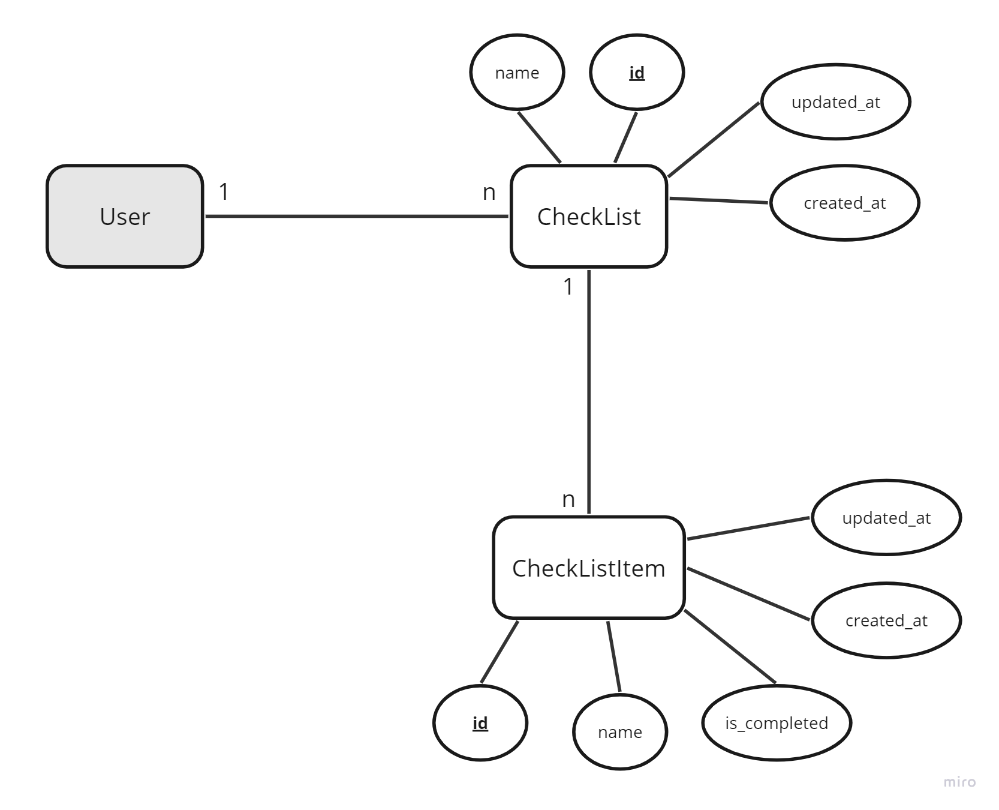

# THWS WAES SS23 Laravel Vue Workshop

## Needed Tools

- [TablePlus](https://tableplus.com/) (oder ein anderer MySQL-fähiger DB-Client)
- [Visual Studio Code](https://code.visualstudio.com/)
- [GitHub Account](https://github.com)
- [Gitpod Account](https://www.gitpod.io/)
- [Repo](https://github.com/Brotzka/thws-waes-ss23) forken
- [Postman](https://www.postman.com/) für das Testen der API Endpunkte

## Projekt

Wir erstellen eine einfache To-Do-App. Das Backend wird hierbei mit Laravel als reines API-Backend geschrieben. Das Frontend wird mit VueJS erstellt.

### Phase 1: Backend

> Für diese Phase ist die offizielle [Laravel-Dokumentation](https://laravel.com/docs/10.x) euer bester Freund.

Ziel ist es, dass wir ensprechend CRUD (Create, Read, Update, Delete) API Endpunkte haben, um neue CheckLists und CheckListItems zu erstellen. Wichtig ist, dass wir eine Validierung integriert haben, so dass wir sichergehen können, dass alle erforderlichen Parameter korrekt übergeben wurden. Zudem wollen wir JSON Responses haben, also strukturierte Objekte anstelle von HTML Code.

Das zugrundeliegende Datenmodell findet ihr weiter unten. Dieses enthält die wichtigsten Attribute, kann aber auch gerne erweitert werden.

Am Ende der Backend-Phase soll es möglich sein:
- eine CheckList zu erstellen und diese an einen User zu hängen
- eine Checklist zu bearbeiten und zu löschen
- sich eine bestimmte CheckList mit allen Items anzuzeigen
- alle CheckLists eines Users anzeigen zu lassen
- einer CheckList Items hinzuzufügen, Items zu löschen, Items zu editieren und als erledigt zu markieren
- E

#### Vorbereitung

Sobald eure Dev-Umgebung läuft, solltet ihr zunächst die schon vorhanden Migrations laufen lassen und ein paar User erstellen. Damit legt Laravel ein paar vordefinierte Tabellen an für die Nutzerverwaltung (`users`-Tabelle, Tabellen für Password-Resets usw.). Dazu:

- wechselt in das `monolith` Verzeichnis: `cd monolith` (öffnet ggfs. ein neues Terminal vorab)
- lasst die Migrations laufen: `sail artisan migrate`
- Erstellt ein paar Dummy-User: `sail artisan db:seed`

Wer mehr zu den Seedern erfahren will, kann sich diese Bereiche der Doku genauer anschauen: [Seeder](https://laravel.com/docs/10.x/seeding) und [Model Factories](https://laravel.com/docs/10.x/eloquent-factories)

#### Ablauf

> Beachte: Das User-Model existiert bereits und muss nicht extra erstellt werden. Hier muss lediglich die Relation im Model hinzugefügt werden.

- Models anlegen (CheckList, CheckListItem) inkl. Migrations, Relationen usw. Siehe dazu diese beiden Bereiche der Doku: [Eloquent ORM](https://laravel.com/docs/10.x/eloquent) und [Database](https://laravel.com/docs/10.x/database)
- CRUD Endpunkte für CheckList und CheckListItem anlegen ([Routes](https://laravel.com/docs/10.x/routing), [Controller](https://laravel.com/docs/10.x/controllers) und [Validation](https://laravel.com/docs/10.x/validation))

### Phase 2: Vue

- Login/Register
- View für Listenerstellung
- View um Items einer Liste hinzuzufügen

### Phase 3: Optimierungen

- Backend
    - Zerlegen der Controller-Logik in Requests, Controller, API Resources
    - Paginierung
- Frontend
    - ...
